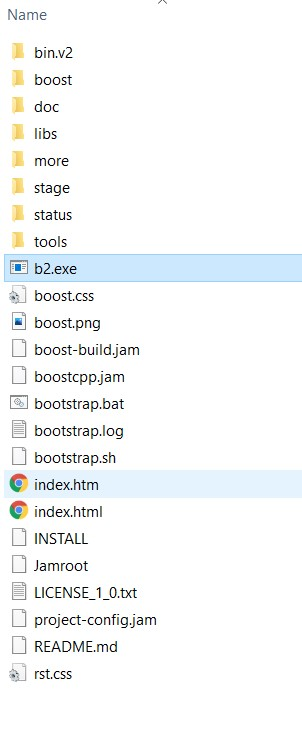

 boost-playground
 ================
 ### Prerequisite
 - Latest version of Visual Studio (currently 2019)
 - Latest version of CMake (currently 3.17.2)
 
 ### How to set up Boost?
 1. [Download latest version](https://www.boost.org/users/download/#live)  (currently 1.73.0)
 2. Unzip to somewhere (`D:\Cpp Libraries` as in `CMakeLists.txt`, replace with your own path)
 3. Execute `bootstrap.bat`, then wait
 4. Execute `b2.exe` generated , then wait
 5. CMake this project
 
 ### The Boost root directory should be like:
 
 
 ### References
 - [c++ - How to build Boost 1.64 in 64 bits- - Stack Overflow](https://stackoverflow.com/questions/43946538/how-to-build-boost-1-64-in-64-bits/43950508)
